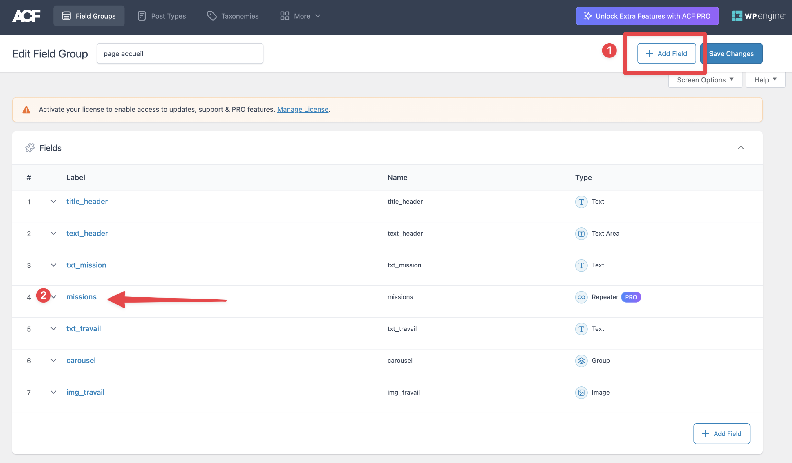
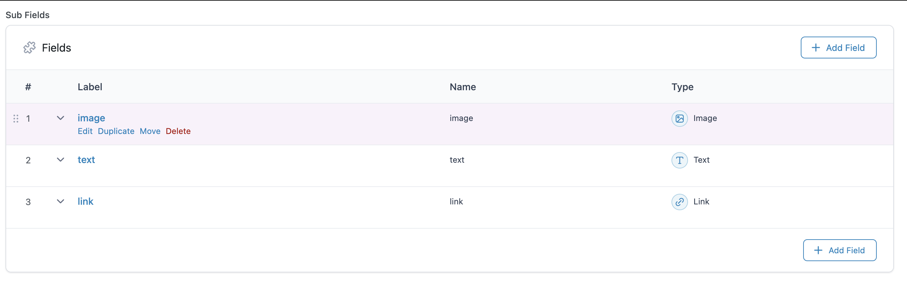
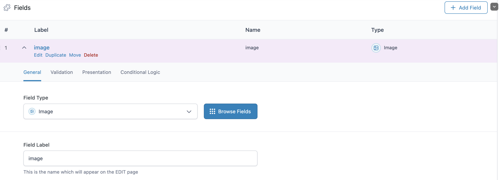

# Projet FIJ

Le projet se trouve [ici](./app/public/wp-content/themes/FIJ_blog)

à l'intention de ceux qui souhaiteraient voir le code complet qui fonctionne et et est bien sûr commenté afin de bien se souvenir des étapes vues en cours de Wordpress/php

j'ajouterai probablement des liens avec les code snippets récurrents sur cette page, n'hésitez pas à me le proposer si vous souhaitez autre chose.

`mirkouch@gmail.com`

À voir dans le dossier correspondant au thème pour les fichiers du projet ...

`app => public => wp-content => themes => FIJ_blog`

---

## explications de ACF

### le plugin [[ACF - advance custom fields]]

```php
" alt="">
```

on va pouvoir écrire des choses du backend wordpress dans mon editeur de code

ça a permis de fetch les `<li> et <a>` des éléments de la nav depuis wordpress
avec le plugin #ACF

[[ACF - advance custom fields]] est super pratique pour pouvoir récupérer des élements du backend pour les envoyer vers le front il utilise des fonctiont php qui sont propres à wordpress

il faudra aller voir dans `function.php` dans l'editeur de code pour utiliser cette function wordpress qui permet de recuperer les titles du menu depuis le backend

## le foreach avec ACF

### récupère les infos du backend

1. utiliser get_field()
2. utiliser une boucle foreach() pourparcourir le repeater
3. afficher avec echo de ce qui est dans $value, en l'occurence ceci:

```
$value['nom_du_champ_dans_acf']
```

et dans le code ca donne ceci...

```php
<div class="d-flex flex-wrap my-5">
  <?php
  $missions = get_field('missions');
  foreach ($missions as $key => $value) {
    ?>
  <div class="border border-black w10 p-2"> <?php echo ($key + 1) . '.'; ?> </div>
  <div class="border border-black w30 p-2">
      " alt="">
  </div>
  <div class="border border-black w30 p-2"> <?php echo $value['text']; ?> </div>
  <div class="border border-black w30 p-2"> <?php echo $value['link']['url']; ?> </div>
  <?php
  }
?>
```

## Explication de l'encodage des champs ACF dans Worxpress

Créer des valeurs dans ACF


ici tu vas pouvoir créer un champ `repeater` qui correspondra en php

à ce type de variable qu'on appellera

```php
<?php
  $missions = get_field('missions');
```

dans un foreach comme ceci pour aller afficher les élements du tableau [array] auquel il corrspond

```php
foreach ($missions as $key => $value) {
```

pour celà il faut crér des subfields dans le `repeater` qui correspondront aux elements de tabeau qu'on souhaite affiche avec le fonction foreach précedemment citée



une fois les élements affichés dans le backend de Wordpress, on peut utiliser ce genre de fonction dans
le fichier loop.php comme ceci par exemple en utilisant bien le nom des champs qu'on aura crée,
image: par exemple



ensuite voici le code qu'on pourra utiliser

```php
<div class="d-flex flex-wrap my-5">
  <?php
  $missions = get_field('missions');
  //
  // permet de voir le nombre d'élements dans le tableau
  // var_dumpj(count($missions));

  foreach ($missions as $key => $value) {
    // condition pour ajouter une classe css
      if ($key == 0) {
        $greenClass = 'bg-green';
      } else {
        $greenClass = '';
      }

      if ($key === count($missions) - 1) {
        $greenClass = 'bg-green';
      }

    ?>
```

ensuite dans le rendu on va appeler la fonctiodu foreach à l'intérieur des balises html

```php
      <div class="border border-black w10 p-2 <?php echo $greenClass ?> "> <?php echo ($key + 1) . '.'; ?> </div>
  <div class="border border-black w30 p-2 <?php echo $greenClass ?> ">
    " alt="">
  </div>
  <div class="border border-black w30 p-2 <?php echo $greenClass ?> "> <?php echo $value['text']; ?> </div>
  <div class="border border-black w30 p-2 <?php echo $greenClass ?> "> <?php echo $value['link']['url']; ?> </div>
  <?php
  }
?>
```

### Attention quand il y a des liens

il faut toujours mettre cette balise a l'intérieur

```php
<script src='<?php echo get_stylesheet_directory_uri(); ?>/js/jquery-3.7.0.min.js'></script>
```
